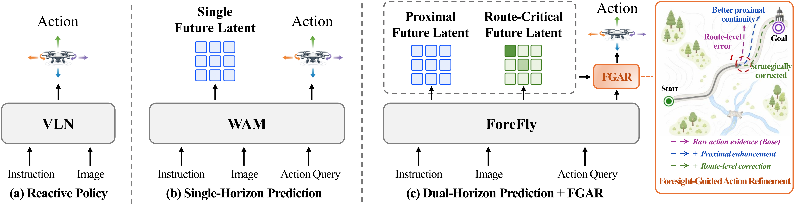

# ForeFly
ForeFly: A Dual-Horizon World Action Model for Aerial Vision-Language Navigation

> [!NOTE]
> 🚧 The code and pretrained weights will be made publicly available upon paper acceptance.

<p align="center">
  
</p>

## 📊 Overview
ForeFly is a dual-horizon world action model for aerial vision-language navigation that predicts proximal and route-critical futures and asymmetrically integrates them for local action enhancement and long-range route correction.

## 📦 Installation

### 1. Clone the repository
```bash
git clone https://github.com/kunhuiW/ForeFly.git
cd ForeFly
```

### 2. Create a Conda environment
```bash
conda create -n forefly python=3.10 -y
conda activate forefly

pip install torch==2.8.0 torchvision==0.23.0 torchaudio==2.8.0 --index-url https://download.pytorch.org/whl/cu128
```

### 3. Install dependencies
```bash
pip install -r requirements.txt
```
```bash
cd Model/LLaMA-UAV
pip install -e .
pip install ninja
pip install flash-attn==2.8.3 --no-build-isolation
```

### 4. Build GroundingDINO extensions

```bash
cd src/model_wrapper/utils/GroundingDINO
python setup.py build_ext --inplace
```
> [!NOTE]
> `python setup.py build_ext --inplace` requires **CUDA 11.x** by default.  
> For **CUDA 12.x**, modify `ms_deform_attn_cuda.cu` by replacing `type()` with `scalar_type()` before compilation. See [this issue comment](https://github.com/IDEA-Research/GroundingDINO/issues/397#issuecomment-3252393560) for reference.

## 📥 Preparation

### 🗂️ Dataset
Obtain the [TravelUAV trajectories](https://huggingface.co/datasets/wangxiangyu0814/TravelUAV) and [split metadata](https://huggingface.co/datasets/wangxiangyu0814/TravelUAV_data_json). The preprocessing tools expect the following layout:

```text
/path/to/TravelUAV/
└── <map>/
    └── <trajectory>/
        ├── log/
        ├── object_description.json
        ├── frontcamera/
        ├── leftcamera/
        ├── rightcamera/
        ├── rearcamera/
        └── downcamera/
```
Generate trajectory metadata, preprocessed image tensors, and future supervision anchors:

```bash
python Model/LLaMA-UAV/tools/generate_merged_json.py \
  --root_dir /path/to/TravelUAV

python Model/LLaMA-UAV/tools/preprocess_image2tensor.py \
  --root_dir /path/to/TravelUAV

python Model/LLaMA-UAV/tools/extract_trajectory_keyframes.py \
  --dataset_path /path/to/TravelUAV \
```

### 🚁 Simulation Environment
Download and extract the [TravelUAV simulator environments](https://huggingface.co/datasets/wangxiangyu0814/TravelUAV_env):

```text
/path/to/envs/
├── carla_town_envs/
│   ├── Town01/
│   ├── Town02/
│   └── ...
├── closeloop_envs/
│   ├── Engine/
│   ├── ModularEuropean/
│   ├── ModularEuropean.sh
│   ├── ModularPark/
│   ├── ModularPark.sh
│   └── ...
└── extra_envs/
    ├── BrushifyUrban/
    ├── BrushifyCountryRoads/
    └── ...
```

### 💾 Pretrained Weights

1. Download the GroundingDINO model from the link [groundingdino_swint_ogc.pth](https://huggingface.co/ShilongLiu/GroundingDINO/resolve/main/groundingdino_swint_ogc.pth), and place the file in the directory `src/model_wrapper/utils/GroundingDINO/`.

2. Download the pretrained weights from the following link [Vicuna-7b-v1.5](https://huggingface.co/lmsys/vicuna-7b-v1.5), [EVA-ViT-G](https://storage.googleapis.com/sfr-vision-language-research/LAVIS/models/BLIP2/eva_vit_g.pth), [QFormer-7b](https://storage.googleapis.com/sfr-vision-language-research/LAVIS/models/InstructBLIP/instruct_blip_vicuna7b_trimmed.pth), and put them in `model_zoo` following structure below.
    ```
    LLaMA-UAV
    ├── model_zoo
    │   ├── vicuna-7b-v1.5
    │   ├── LAVIS
    │   │   ├── eva_vit_g.pth
    │   │   ├── instruct_blip_vicuna7b_trimmed.pth
    ```

3. The weights of **ForeFly** will be made publicly available upon paper acceptance. Once released, please place the downloaded weights in the `LLaMA-UAV/work_dirs/` directory.

## 🚀 Training
> [!IMPORTANT]
> Before training, make sure the dataset preprocessing is complete and the following files have been generated for each trajectory:
> - `turn_points.json`
> - `rgb_imgs.tensor`
> - `merged_data.json`
> - `depth_imgs.tensor`
```bash
cd Model/LLaMA-UAV
bash scripts/llm/train_forefly.sh.
```

## 🎯 Evaluation
### 1. Start the simulator server
```bash
conda activate forefly
cd /path/to/ForeFly/airsim_plugin
```
```bash
python AirVLNSimulatorServerTool.py  --port 30000 --root_path /path/to/envs
```

### 2. Run navigation

```bash
bash scripts/eval.sh
```

## 🔧 Troubleshooting

### Very Slow AirSim Image Retrieval

If image retrieval from AirSim is extremely slow, this may be caused by the obsolete pure-Python `msgpack` implementation. Replace it with the latest `msgpack` package and install the `fix-msgpack-dep` branch of `msgpack-rpc-python`:

```bash
pip uninstall msgpack-rpc-python msgpack-python
pip install msgpack
```

Additional modifications to the AirSim Python client may be required. See [this issue comment](https://github.com/microsoft/AirSim/issues/3333#issuecomment-827894198) for detailed instructions.

## 📝 Citation
If you find **ForeFly** useful in your research, please consider citing our work:
```bibtex
@misc{wang2026foreflydualhorizonworldaction,
  title         = {ForeFly: A Dual-Horizon World Action Model for Aerial Vision-Language Navigation},
  author        = {Kunhui Wang and Xintong Zhang and Junyu Gao and Changsheng Xu},
  year          = {2026},
  eprint        = {2609.33581},
  archivePrefix = {arXiv},
  primaryClass  = {cs.CV},
  url           = {https://arxiv.org/abs/2609.33581}
}
```

## 🤝 Acknowledgements
This project builds upon [TravelUAV](https://github.com/prince687028/TravelUAV). We thank the authors for their excellent work.